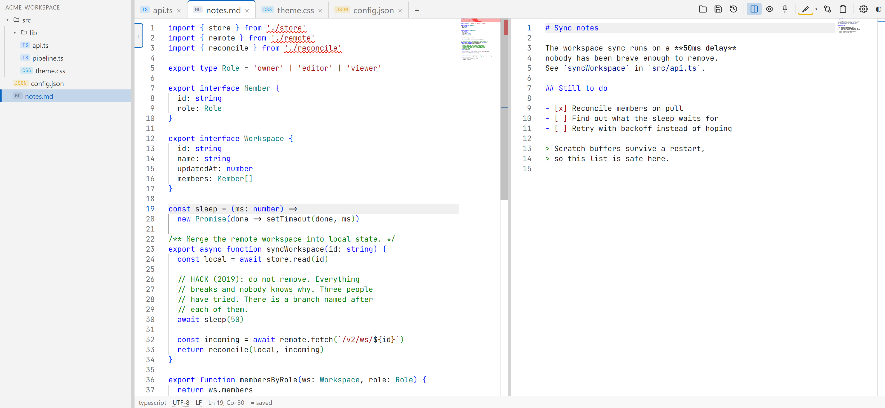
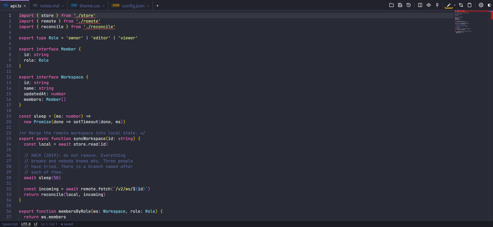
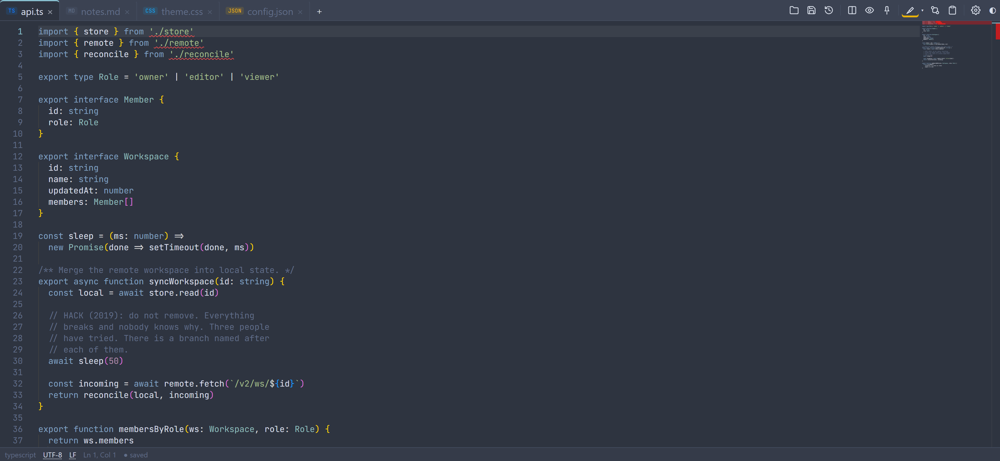
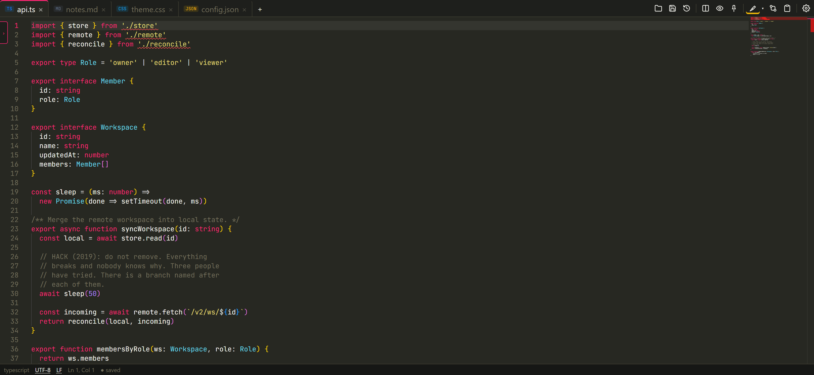
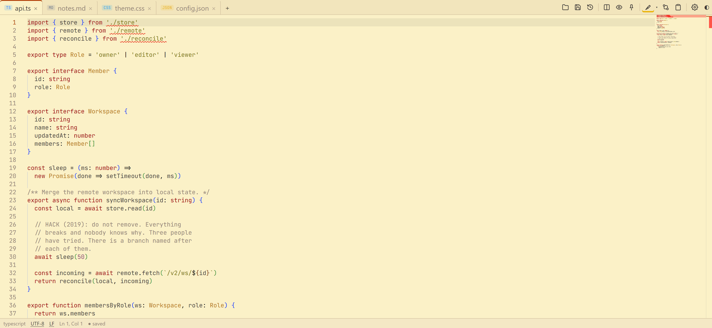
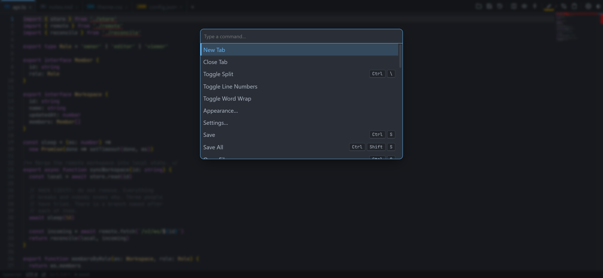
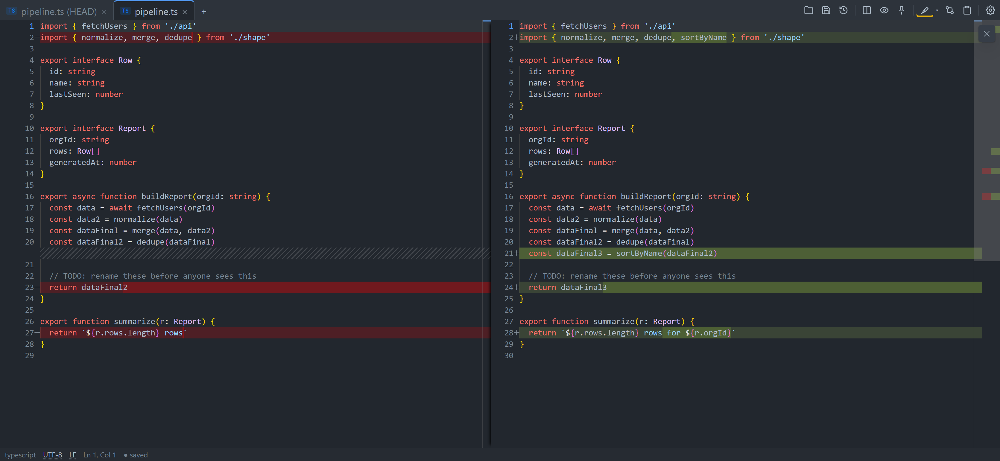

<p align="center">
  <picture>
    <source media="(prefers-color-scheme: dark)" srcset="assets/branding/notes-and-codes-logo/svg/nc-wordmark-dark.svg">
    
  </picture>
</p>

<h1 align="center">Notes & Codes</h1>

<p align="center">
  <strong>Notepad-simple. Code-editor-powerful.</strong><br>
  A fast, Windows-first scratchpad for notes, code, and everything in between.
</p>

<p align="center">
  <a href="../../releases/latest"></a>
  <a href="https://github.com/NetworkMD87/Notes-and-codes/actions/workflows/ci.yml"></a>
  <a href="#install"></a>
  <a href="LICENSE"></a>
</p>

<p align="center">
  <a href="#install">Download</a> · <a href="#features">Features</a> ·
  <a href="#shortcuts">Shortcuts</a> · <a href="#build-from-source">Build from source</a>
</p>

<p align="center">
  <picture>
    <source media="(prefers-color-scheme: dark)" srcset="assets/screenshots/hero-dark.png">
    
  </picture>
</p>

Summon it with a global hotkey, paste the thing, and close it—it remembers. Open a folder and it
becomes a focused editor with tabs, split panes, quick open, content search, diffs, and file history.
No workspace setup, account, or cloud connection required.

## Install

1. Get **Notes.Codes.Setup.x.y.z.exe** from the [latest release](../../releases/latest), or choose
   **Notes.Codes.x.y.z.exe** for the portable build.
2. Run it on Windows x64. Installation is per-user and needs no administrator access.
3. Start typing, or enable **Open with Notes & Codes** in Settings ▸ Integration for Explorer.

> [!NOTE]
> Releases are currently unsigned. If SmartScreen appears, choose **More info ▸ Run anyway**.

## What's new

- **[v1.19.2](https://github.com/NetworkMD87/Notes-and-codes/releases/tag/v1.19.2):** upgrades
  the Electron runtime and build toolchain to audit-clean releases, keeps PDF exports offline,
  restricts privileged app navigation, and preserves external-change warnings without resurfacing
  duplicates after **Keep mine**.
- **[v1.19.1](https://github.com/NetworkMD87/Notes-and-codes/releases/tag/v1.19.1):** files opened
  from Explorer replace only a disposable blank tab, and the highlighter remembers its active
  colour across app restarts without enabling paint mode.
- **[v1.19.0](https://github.com/NetworkMD87/Notes-and-codes/releases/tag/v1.19.0):** faster 20k-file
  workspaces, keyboard- and screen-reader-ready controls, configurable workspace exclusions, and
  scoped Find in Files across disk files, dirty tabs, loose files, and untitled notes.
- **[v1.18.1](https://github.com/NetworkMD87/Notes-and-codes/releases/tag/v1.18.1):** patched the
  Markdown preview/export sanitizer and linkifier dependencies, kept the production audit clean,
  and made Windows release smoke validation more reliable.
- **[v1.18.0](https://github.com/NetworkMD87/Notes-and-codes/releases/tag/v1.18.0):** right-click a
  misspelling for local suggestions, Ignore, Add to Dictionary, and familiar editing actions.
- **[v1.17.0](https://github.com/NetworkMD87/Notes-and-codes/releases/tag/v1.17.0):** private,
  fully offline UK and US English spell checking for plain text and Markdown.

See the [changelog](CHANGELOG.md) for every release and fix.

## Features

- **Fast by default.** Configurable global summon hotkey, system-tray lifecycle, optional
  launch-on-login, single-instance file routing, and automatic session recovery.
- **A real editor when you need one.** Drag-reorderable tabs, split panes, folder tree, quick open,
  Prettier formatting, UTF-8/UTF-16 and LF/CRLF control, plus tab, clipboard, and file diffs.
- **Search what is actually on screen.** Find in Files (`Ctrl+Shift+F`) searches the open folder and
  every open tab—including unsaved edits—with previews, line numbers, case, and whole-word controls.
- **Private spelling help.** Offline UK/US/follow-Windows dictionaries, Markdown-aware exclusions,
  Quick Fix (`Ctrl+.`), right-click suggestions, session ignores, and a personal dictionary.
- **Designed against data loss.** Atomic writes, scratch-buffer recovery, overwrite protection,
  queued external-change conflicts, auto-save, Revert File, and browsable file history.
- **Useful creative tools.** Live Markdown preview, self-contained HTML/PDF export, paste history,
  snippets, an 18-colour highlighter whose marks and active colour survive relaunches, command
  palette, and searchable in-app help.
- **Made to feel at home.** Thirteen themes, eighteen accents with automatic contrast, bundled
  coding fonts, separate interface fonts, reduced-motion support, and theme-aware Windows icons.

|  |  |
|:--:|:--:|
| <br>**Dracula** | <br>**Nord** |
| <br>**Monokai** | <br>**Gruvbox Light** |

**Find any action.**



**Compare changes without leaving the app.**



## Shortcuts

| Action | Key |
|---|---|
| Command palette / Quick open | `Ctrl+Shift+P` / `Ctrl+P` |
| Find in Files / Spelling Quick Fix | `Ctrl+Shift+F` / `Ctrl+.` |
| Open file / folder | `Ctrl+O` / `Ctrl+K` |
| Save / Save As / Save All | `Ctrl+S` / `Ctrl+Shift+A` / `Ctrl+Shift+S` |
| New / close tab | `Ctrl+T` / `Ctrl+W` |
| Find / replace | `Ctrl+F` / `Ctrl+H` |
| Format document / Toggle split | `Shift+Alt+F` / `Ctrl+\` |
| Settings / Quit | `Ctrl+,` / `Ctrl+Q` |
| Summon / hide globally | `Ctrl+Shift+Space` (configurable) |

The complete searchable reference lives under **Help ▸ Shortcuts & Commands**.

## Built with care

- Strict TypeScript builds and focused Vitest tests run on Windows CI.
- Playwright drives the real built Electron app in isolated user-data directories before releases.
- Atomic persistence, overwrite guards, recovery, and file history protect user content.
- The sandboxed renderer uses a narrow, typed, sender-validated IPC bridge.
- Two closed codebase audits are published in [AUDIT-CHECKLIST.md](AUDIT-CHECKLIST.md).

<details>
<summary><strong>Engineering and verification details</strong></summary>

The app runs with `contextIsolation: true`, `sandbox: true`, and `nodeIntegration: false`. Every IPC
handler rejects messages outside the app window's own main frame; CSP excludes `unsafe-eval`, and
Markdown is rendered with raw HTML disabled before DOMPurify sanitisation.

Cross-cutting guards are falsified before being trusted: introduce the failure, watch the targeted
assertion turn red, then restore the implementation. Release smoke tests run locally because hosted
Windows runners do not reliably paint Monaco's viewport.

Rejected changes keep their rationale. For example, `fsync` was removed after Windows
`FlushFileBuffers` latency stalled routine writes for a marginal durability gain. Committed icons
and screenshots also regenerate deterministically: unchanged input must leave Git clean.

</details>

## Build from source

Requires Node.js 22.12 or newer and npm 11 or newer.

```powershell
npm ci
npm run dev          # Electron development mode with HMR
npm run build        # Type-check, then compile
npm test             # Vitest unit tests
npm run test:smoke   # Playwright Electron tests; build first
npm run screenshots  # Regenerate README screenshots
npm run package      # Installer + portable executable
```

Packaging requires Windows Developer Mode or an elevated shell for electron-builder's symlink step.
Bug reports and focused improvements are welcome in the
[issue tracker](https://github.com/NetworkMD87/Notes-and-codes/issues).

## License

[MIT](LICENSE). Bundled JetBrains Mono, Fira Code, and IBM Plex Mono fonts use the SIL Open Font
License 1.1; see [THIRD_PARTY_NOTICES.md](THIRD_PARTY_NOTICES.md).
